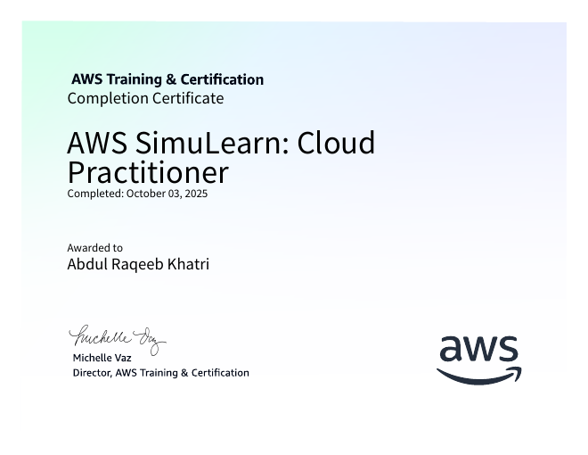
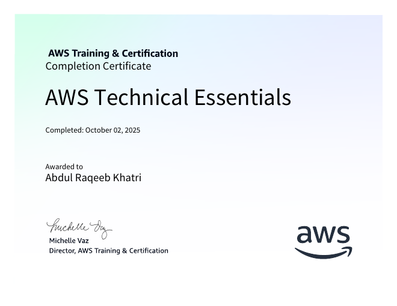
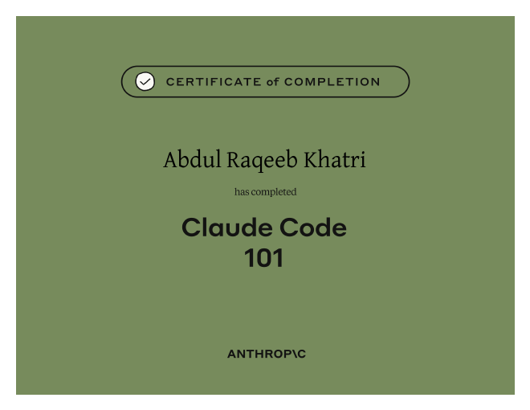
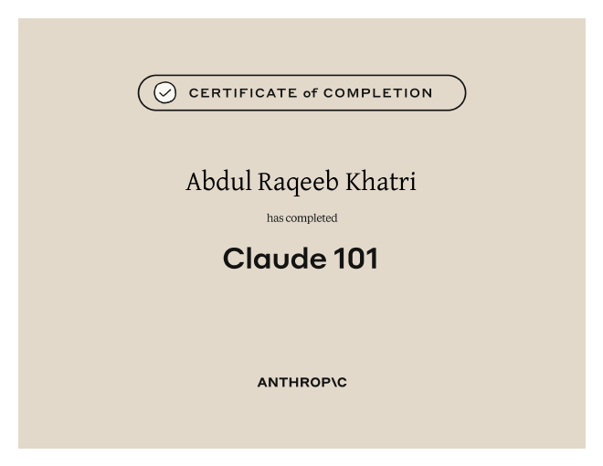
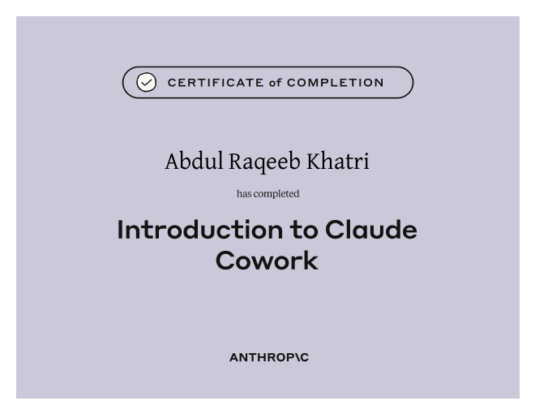
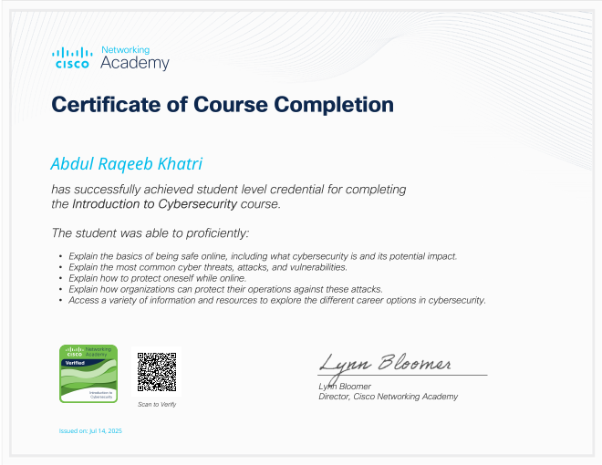
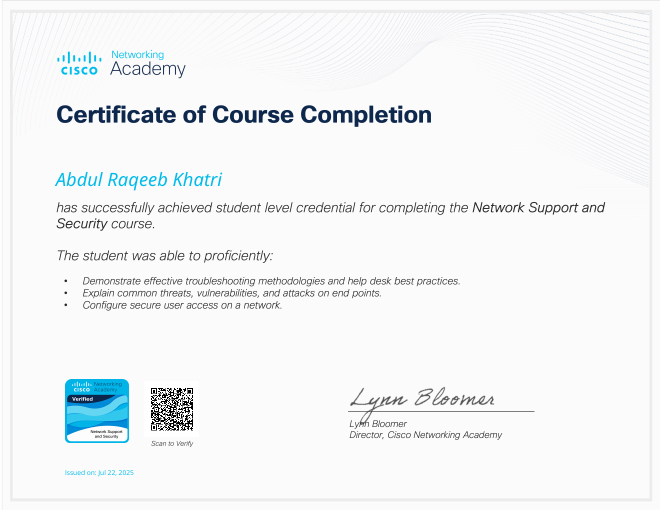
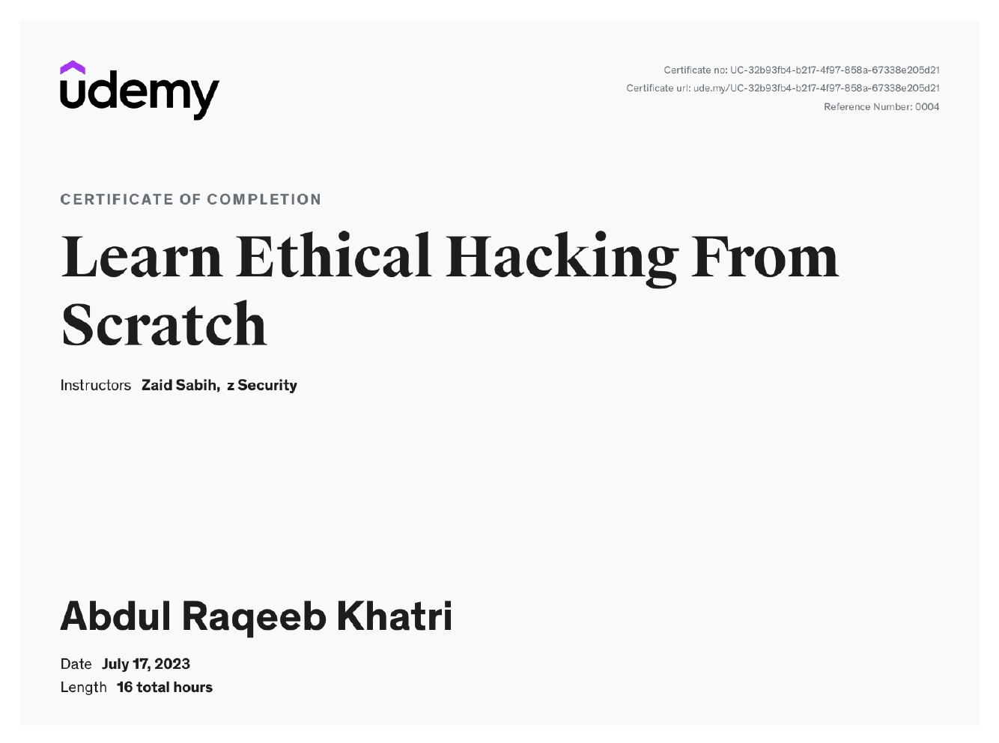

<h1 align="center">📜 Certifications</h1>

<em>40 certificates across Cloud, AI, Security &amp; Networking — earned by Abdul Raqeeb Khatri.</em>

  
  
  
  

> A snapshot of continuous learning across the four areas my projects live in: **Cloud (AWS)**, **AI (Anthropic)**, **Security & Networking (Cisco + Udemy)**. Click any thumbnail to open the certificate. *More on the way.* ✨

---

## 🌟 Highlights

  
  
  
  

  
  
  
  

---

## ☁️ Amazon Web Services
*Issued by AWS (Skill Builder / Educate) · 2025*

> 🏅 **Flagship: [AWS SimuLearn — Cloud Practitioner](aws/simulearn-cloud-practitioner/aws-simulearn-cloud-practitioner.pdf)** — a 12-module, hands-on simulation track spanning compute, networking, databases, security, and cloud economics.

### Core & service certificates

| Certificate | Link |
|-------------|------|
| Getting Started with AWS Cloud Essentials | [PDF](aws/getting-started-with-aws-cloud-essentials.pdf) |
| AWS Technical Essentials | [PDF](aws/aws-technical-essentials.pdf) |
| AWS Shared Responsibility Model | [PDF](aws/aws-shared-responsibility-model.pdf) |
| Introduction to Amazon EC2 | [PDF](aws/introduction-to-amazon-ec2.pdf) |
| Introduction to Amazon S3 | [PDF](aws/introduction-to-amazon-simple-storage-services.pdf) |
| Introduction to Amazon VPC | [PDF](aws/introduction-to-amazon-vpc.pdf) |
| Introduction to AWS IAM | [PDF](aws/introduction-to-aws-identity-and-access-management.pdf) |
| Introduction to AWS Lambda | [PDF](aws/introduction-to-aws-lambda.pdf) |
| Introduction to AWS Solutions | [PDF](aws/introduction-to-aws-solutions.pdf) |
| AWS Free Tier: Introduction to Managing Services | [PDF](aws/free-tier-introduction-to-managing-services.pdf) |
| Migrating VMware Workloads to AWS | [PDF](aws/migrating-vmware-workloads-to-aws.pdf) |
| Job Roles in the Cloud | [PDF](aws/job-roles-in-the-cloud.pdf) |

<strong>🏅 AWS SimuLearn — Cloud Practitioner · 12 module certificates</strong>

| Module | Link |
|--------|------|
| Cloud First Steps | [PDF](aws/simulearn-cloud-practitioner/courses/aws-simulearn-cloud-first-steps.pdf) |
| Cloud Computing Essentials | [PDF](aws/simulearn-cloud-practitioner/courses/aws-simulearn-cloud-computing-essentials.pdf) |
| Computing Solutions | [PDF](aws/simulearn-cloud-practitioner/courses/aws-simulearn-computing-solutions.pdf) |
| Networking Concepts | [PDF](aws/simulearn-cloud-practitioner/courses/aws-simulearn-networking-concepts.pdf) |
| Connecting VPCs | [PDF](aws/simulearn-cloud-practitioner/courses/aws-simulearn-connecting-vpcs.pdf) |
| Core Security Concepts | [PDF](aws/simulearn-cloud-practitioner/courses/aws-simulearn-core-security-concepts.pdf) |
| Databases in Practice | [PDF](aws/simulearn-cloud-practitioner/courses/aws-simulearn-databases-in-practice.pdf) |
| First NoSQL Database | [PDF](aws/simulearn-cloud-practitioner/courses/aws-simulearn-first-nosql-database.pdf) |
| File Systems in the Cloud | [PDF](aws/simulearn-cloud-practitioner/courses/aws-simulearn-file-systems-in-the-cloud.pdf) |
| Highly Available Web Applications | [PDF](aws/simulearn-cloud-practitioner/courses/aws-simulearn-highly-available-web-applications.pdf) |
| Auto-Healing and Scaling Applications | [PDF](aws/simulearn-cloud-practitioner/courses/aws-simulearn-auto-healing-and-scaling-applications.pdf) |
| Cloud Economics | [PDF](aws/simulearn-cloud-practitioner/courses/aws-simulearn-cloud-economics.pdf) |

<strong>🛠️ AWS Account Setup Learning Plan · summary + 7 course certificates</strong>

Summary: [AWS Account Setup Learning Plan](aws/account-setup-learning-plan/aws-account-setup-learning-plan.pdf)

| Course | Link |
|--------|------|
| Introduction to AWS Management Console | [PDF](aws/account-setup-learning-plan/courses/introduction-to-aws-management-console.pdf) |
| IAM — Basics | [PDF](aws/account-setup-learning-plan/courses/aws-identity-and-access-management-basics.pdf) |
| IAM — Architecture and Terminology | [PDF](aws/account-setup-learning-plan/courses/aws-identity-and-access-management-architecture-and-terminology.pdf) |
| IAM — Troubleshooting | [PDF](aws/account-setup-learning-plan/courses/aws-identity-and-access-management-iam-troubleshooting.pdf) |
| AWS Billing and Cost Management | [PDF](aws/account-setup-learning-plan/courses/aws-billing-and-cost-management.pdf) |
| Security Hub CSPM — Getting Started | [PDF](aws/account-setup-learning-plan/courses/aws-security-hub-cspm-getting-started.pdf) |
| AWS Free Tier — Introduction to Monitoring Services | [PDF](aws/account-setup-learning-plan/courses/aws-free-tier-ntroduction-to-monitoring-services.pdf) |

---

## 🤖 Anthropic
*Issued by Anthropic Education · 2025*

| Certificate | Link |
|-------------|------|
| Claude 101 | [PDF](anthropic/claude-101.pdf) |
| Claude Code 101 | [PDF](anthropic/claude-code-101.pdf) |
| Introduction to Claude Cowork | [PDF](anthropic/introduction-to-claude-cowork.pdf) |

---

## 🔐 Cisco
*Issued by Cisco Networking Academy · 2025*

| Certificate | Link |
|-------------|------|
| Introduction to Cybersecurity | [PDF](cisco/introduction-to-cybersecurity.pdf) |
| Network Support and Security | [PDF](cisco/network-support-and-security.pdf) |
| IT Customer Support Basics | [PDF](cisco/it-customer-support-basics.pdf) |

---

## 🎯 Udemy
*Issued by Udemy · 2023*

| Certificate | Instructor | Length | Link |
|-------------|-----------|--------|------|
| Learn Ethical Hacking From Scratch | Zaid Sabih · zSecurity | 16 hrs | [PDF](udemy/learn-ethical-hacking-from-scratch.pdf) |

---

← Back to <a href="../README.md">Portfolio</a>

